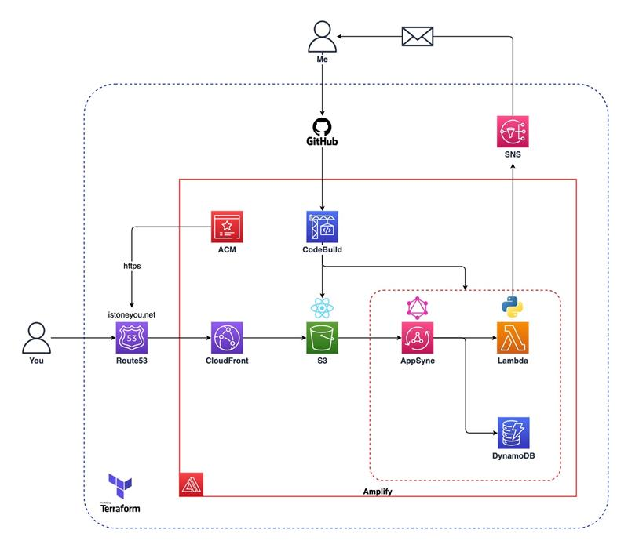
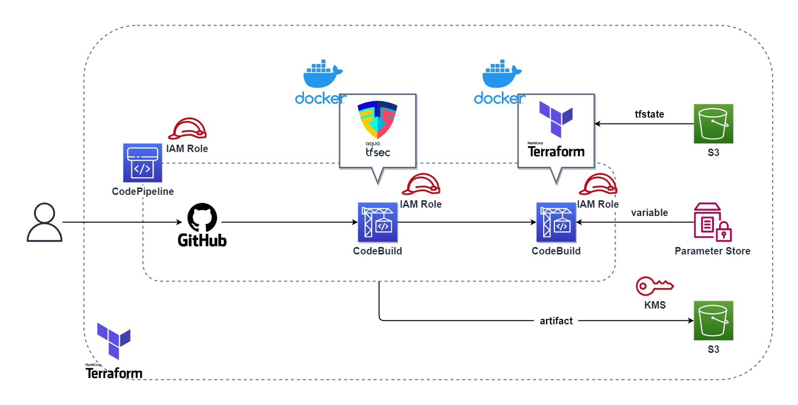
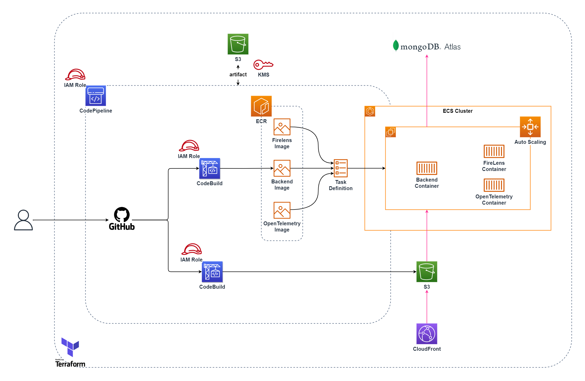
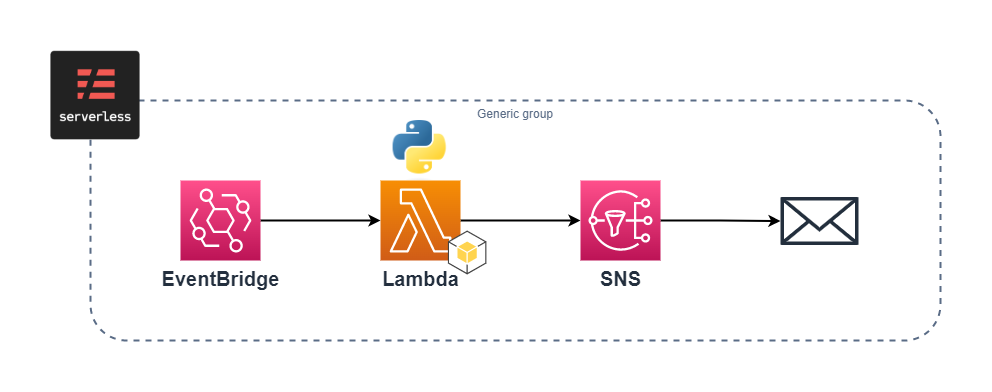
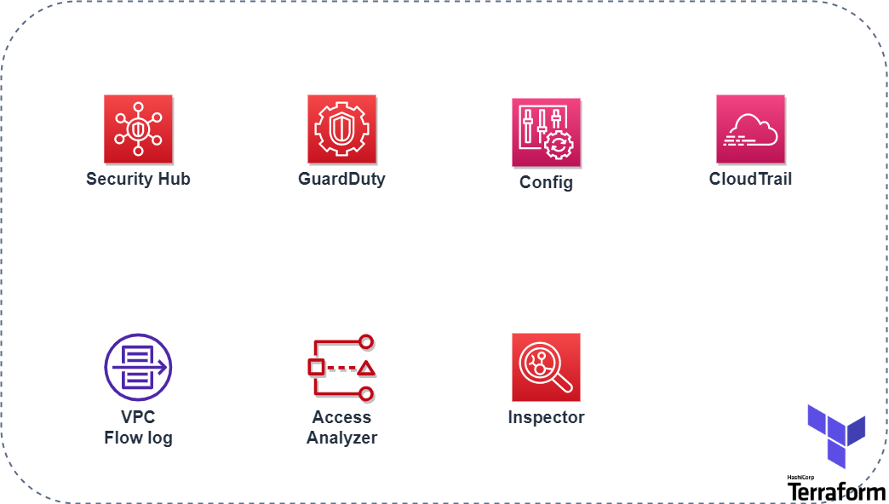
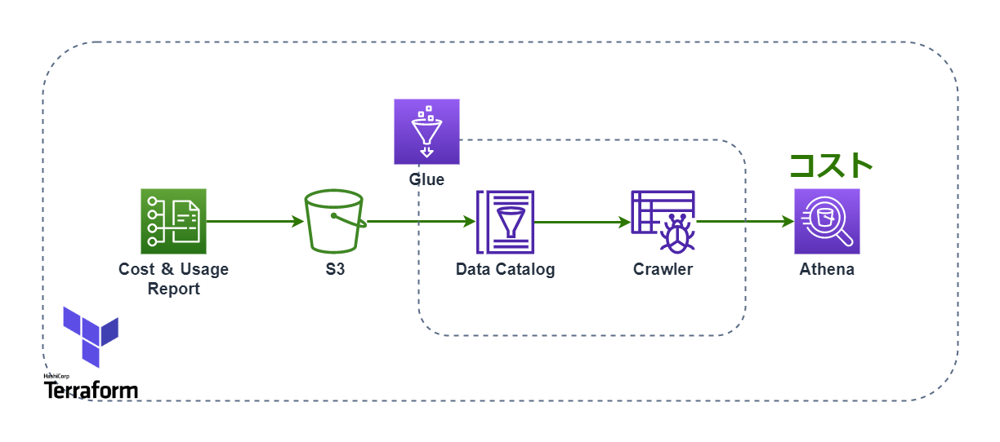
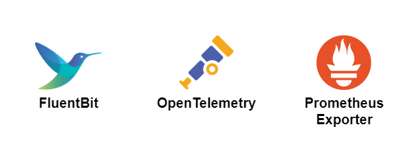

# レポジトリの解説

## [my-amplify-website](https://github.com/istone-you/my-amplify-website)
React.jsをベースとした静的サイトジェネレーターであるGatsby.jsを使ったWebサイトです。
AWS Amplifyにデプロイしています。

## [my-amplify-website-terraform](https://github.com/istone-you/my-amplify-website-terraform)
上記[my-amplify-website](https://github.com/istone-you/my-amplify-website)の構成を構築するTerraformファイルです。

## [aws-terraform-cicd](https://github.com/istone-you/aws-terraform-cicd)
上記[my-amplify-website-terraform](https://github.com/istone-you/my-amplify-website-terraform)のTerraformファイルをCodeBuildとCodePipelineを使って実行する構成を構築するTerraformファイルです。

## [memo-app-mern-stack](https://github.com/istone-you/memo-app-mern-stack)
MERN(MongoDB,Express.js,React.js,Node.js)スタックを利用したメモアプリです。

## [memo-app-ecs-terraform](https://github.com/istone-you/memo-app-ecs-terraform)
上記[memo-app-mern-stack](https://github.com/istone-you/memo-app-mern-stack)をS3とECS,CodePipelineを使って構築するTerraformファイルです。

## [aws-cost-mail-serverless](https://github.com/istone-you/aws-cost-mail-serverless)
利用料金をメールで通知するLambdaを作成する構成を構築するServerless Frameworkのファイルです。

## [aws-security-terraform](https://github.com/istone-you/aws-security-terraform)
AWSのアカウントのセキュリティサービスを設定するTerraformファイルです。

## [aws-cost-terraform](https://github.com/istone-you/aws-cost-terraform)
AWS Cost and Usage Reportの結果をAmazon S3に保存。そのデータをAWS GlueとAmazon Athenaを使ってクエリする構成を設定するTerraformファイルです。

## [observablity-ansible](https://github.com/istone-you/observablity-ansible)
PrometheusのNode ExporterとOpenTelemetry、Fluent Bitをサーバーにインストールして、メトリクスとログをそれぞれPrometheusとLokiに送信する設定をするAnsibleのPlaybookです。

## [RecordApp](https://github.com/istone-you/RecordApp)
未経験時に初めて作成したRuby on Railsのアプリです。

## [HTML-Test](https://github.com/istone-you/HTML-Test)
未経験時に初めて作成したHTMLのサイトです。
