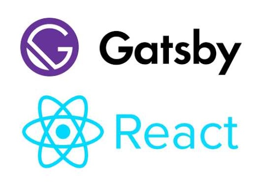

# レポジトリの解説

## JavaScript

### ・[my-amplify-website](https://github.com/istone-you/my-amplify-website)
React.jsをベースとした静的サイトジェネレーターであるGatsby.jsを使ったWebサイトです。

### ・[memo-app-mern-stack](https://github.com/istone-you/memo-app-mern-stack)
MERN(MongoDB,Express.js,React.js,Node.js)スタックを利用したメモアプリです。

## Python

### ・[aws-cost-mail-serverless](https://github.com/istone-you/aws-cost-mail-serverless)
利用料金をメールで通知するLambdaを作成する構成を構築するServerless Frameworkのファイルです。

## Terraform

### ・[my-amplify-website-terraform](https://github.com/istone-you/my-amplify-website-terraform)
上記[my-amplify-website](https://github.com/istone-you/my-amplify-website)をAmplifyを使って構築するTerraformファイルです。

### ・[aws-terraform-cicd](https://github.com/istone-you/aws-terraform-cicd)
上記[my-amplify-website-terraform](https://github.com/istone-you/my-amplify-website-terraform)のTerraformファイルをCodeBuildとCodePipelineを使って実行する構成を構築するTerraformファイルです。

### ・[memo-app-ecs-terraform](https://github.com/istone-you/memo-app-ecs-terraform)
上記[memo-app-mern-stack](https://github.com/istone-you/memo-app-mern-stack)をS3とECS,CodePipelineを使って構築するTerraformファイルです。

### ・[aws-security-terraform](https://github.com/istone-you/aws-security-terraform)
AWSのアカウントのセキュリティサービスを設定するTerraformファイルです。

### ・[aws-cost-terraform](https://github.com/istone-you/aws-cost-terraform)
AWS Cost and Usage Reportの結果をAmazon S3に保存。そのデータをAWS GlueとAmazon Athenaを使ってクエリする構成を設定するTerraformファイルです。

## Ansible

### ・[observability-ansible](https://github.com/istone-you/observability-ansible)
PrometheusのNode ExporterとOpenTelemetry、Fluent Bitをサーバーにインストールして、メトリクスとログをそれぞれPrometheusとLokiに送信する設定をするAnsibleのPlaybookです。

### ・[convenient-ami-pakcer-ansible](https://github.com/istone-you/convenient-ami-pakcer-ansible)

PackerとAnsibleを使って、自分がよく使うツールが予め用意されたEC2のAMIを作成するファイルです。

## Dockerfile

### ・[observability-ecs](https://github.com/istone-you/observability-ecs)
OpenTelemetryとFluent BitをECSで使用するためのDockerfileです。

## その他

### ・[RecordApp](https://github.com/istone-you/RecordApp)
未経験時に初めて作成したRuby on Railsのアプリです。

### ・[HTML-Test](https://github.com/istone-you/HTML-Test)
未経験時に初めて作成したHTMLのサイトです。
